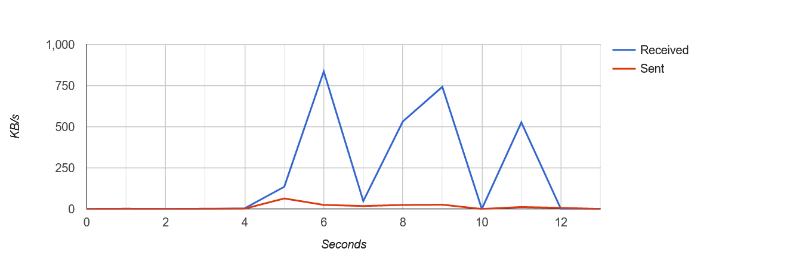

# trackbit

[](https://github.com/viveknathani/trackbit/actions/workflows/test.yaml) 
[](https://goreportcard.com/report/github.com/viveknathani/trackbit)
[](https://codeclimate.com/github/viveknathani/trackbit/maintainability) 

trackbit is a network throughput monitoring tool, built for Windows and Linux. It grabs the network information from your OS so it does not sniff your packets.



## why

Internet providers claim a certain bandwidth while selling you your connection. Seeing the throughput makes understand what you really get. 

## getting started

You need to know the name of your interface or adapter for which the throughput will be tracked. 
On Linux, you need the name of your interface. So go ahead and do, 
```bash
ifconfig
```
The left-most value written against your network is the interface name. One common name is `eth0`.  
On Windows, you need the name of your network adapter. So go to your command prompt and do,
```bash
ifconfig /all
```
Find your network. The `Description` field is your adapter name. 

## build and run

From the root of this project, 
```bash
make build
make run
# or you can invoke the command manually to specify the port, default is 8080
./bin/trackbit -=port=8081 # any port number
```

# running in the background

You can setup `trackbit` to keep collecting network info in the background and dump the info to a file, `trackbit.json` upon shutdown. You will be asked to enter a path to the directory of this file for this. If you want to view your history, click the history button on the homepage. 

To setup in this way, here is an example:  
```bash
./bin/trackbit --port=8081 --path=./bin
```

## similar projects

- [realtimetraffic](https://github.com/longsleep/realtimetraffic/) - Works for Linux only.
- [vnstat](https://github.com/vergoh/vnstat) - Has a broader scope, but works for Linux and BSD.

## license

[MIT](./LICENSE)
